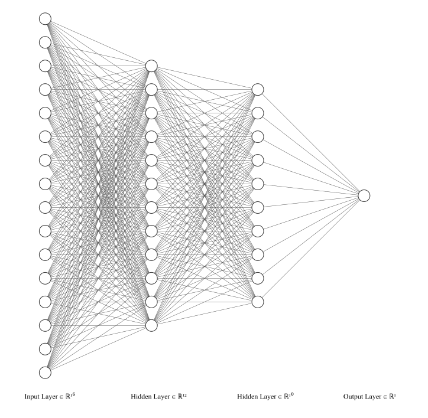

# [NN-Visuals](https://github.com/vuhung16au/Neural-Network-Visualisation)

Creating illustrations of Neural Network architectures is traditionally a time-consuming process, where machine learning researchers often spend hours constructing intricate diagrams manually. This repetitive task diverts valuable research time and creates inconsistencies across publications.

NN-Visuals is an advanced tool for generating Neural Network (NN) architecture visualizations parametrically through an intuitive interface. It allows researchers to quickly export high-quality diagrams as both Scalable Vector Graphics (SVG) for vector-based publication needs and PNG images for presentations and digital sharing.

## Features

- **Interactive Visualization Engine**: Create complex neural network architecture visualizations through a parameter-driven interface
- **Comprehensive Customization**: Fine-tune node sizes, colors, edge styles, transparency, spacing, and layout properties
- **Multiple Export Options**: Download as SVG files for vector graphics in publications or PNG images for presentations
- **Three Specialized Visualization Styles**:
  - FCNN: Classic fully-connected network visualization with customizable layers and connections
  - LeNet-style: CNN visualization with feature maps and convolutional filters
  - AlexNet-style: Modern 3D deep network visualization with interactive camera controls
- **Responsive Design**: Optimized for both desktop and mobile viewing experiences
- **Server-Side Rendering**: High-quality PNG export with server-side processing for consistent results

I designed this tool to save valuable time for machine learning researchers while ensuring publication-quality visualizations. Additionally, NN-Visuals serves as an effective pedagogical tool for teaching neural network concepts through visual representation.


## Examples

<div style="display: flex; justify-content: space-between; margin: 20px 0;">
    
    
    
</div>


## How to Run

### Prerequisites

Before running the application, ensure you have the following installed:
- [Node.js](https://nodejs.org/) (v14.0.0 or higher)
- [npm](https://www.npmjs.com/) (usually comes with Node.js)

### Setup and Installation

1. Clone the repository:

   ```bash
   git clone https://github.com/vuhung16au/Neural-Network-Visualisation.git
   cd Neural-Network-Visualisation
   ```

2. Install dependencies:

   ```bash
   npm install
   ```

   Or use the setup script which installs all dependencies including image processing libraries:

   ```bash
   npm run setup
   ```

### Running the Server

To run the application in development mode with hot-reloading:
```bash
npm run start:dev
```

To run in production mode:
```bash
npm start
```

The server will start running on [http://localhost:3000](http://localhost:3000) by default. You will see a detailed console output with available pages and endpoints.

### Available Pages

- Main page: [http://localhost:3000/](http://localhost:3000/)
- AlexNet visualization: [http://localhost:3000/AlexNet.html](http://localhost:3000/AlexNet.html)
- LeNet visualization: [http://localhost:3000/LeNet.html](http://localhost:3000/LeNet.html)
- Fully Connected Neural Network: [http://localhost:3000/FCNN.html](http://localhost:3000/FCNN.html)
- About page: [http://localhost:3000/about.html](http://localhost:3000/about.html)

### Deploying to Vercel

Vercel is a cloud platform that enables developers to host websites and web services. Follow these steps to deploy NN-Visuals to Vercel:

1. Install the Vercel CLI:

   ```bash
   npm install -g vercel
   ```

2. Login to Vercel:

   ```bash
   vercel login
   ```

3. Deploy from your local project directory:

   ```bash
   vercel
   ```

4. For production deployment:

   ```bash
   vercel --prod
   ```

Alternatively, you can deploy directly from GitHub:

1. Push your code to a GitHub repository
2. Visit [Vercel Dashboard](https://vercel.com/dashboard)
3. Click "New Project" and select your repository
4. Configure the following settings:
   - Build Command: `npm install`
   - Output Directory: `.` (root directory)
   - Install Command: `npm install`
5. Click "Deploy"

Vercel will automatically detect and configure the project as a Node.js application. Your application will be accessible via a unique domain provided by Vercel, with an option to add a custom domain later.

## Recent Updates

- Completely redesigned UI with modern color scheme and improved visual hierarchy (May 2025)
- Enhanced PNG export functionality with improved loading indicators
- Added responsive design improvements for better mobile experience
- Reorganized controls into logical groupings for better usability
- Enhanced form control styling (checkboxes, radio buttons, range sliders)
- Added 404 page, improved server console output, and SEO enhancements
- Added a new "How to Use" page with detailed instructions and tips
- Added a new "About" page with information about the project and its creator